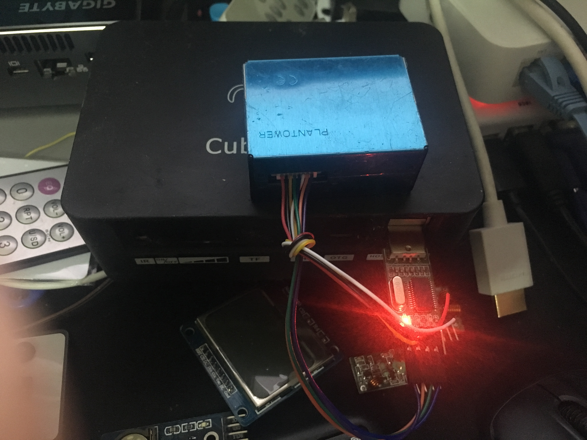

## dsensor 

> Digital universal particle concentration sensor 

### Installation

```bash
$ npm i dsensor
```

### Example

```js
const Sensor = require('dsensor');

var sensor = new Sensor('/dev/cu.usbserial');

sensor.on('data', function(data){
  console.log(data);
});
```



### Contributing
- Fork this Repo first
- Clone your Repo
- Install dependencies by `$ npm install`
- Checkout a feature branch
- Feel free to add your features
- Make sure your features are fully tested
- Publish your local branch, Open a pull request
- Enjoy hacking <3

### MIT

---
