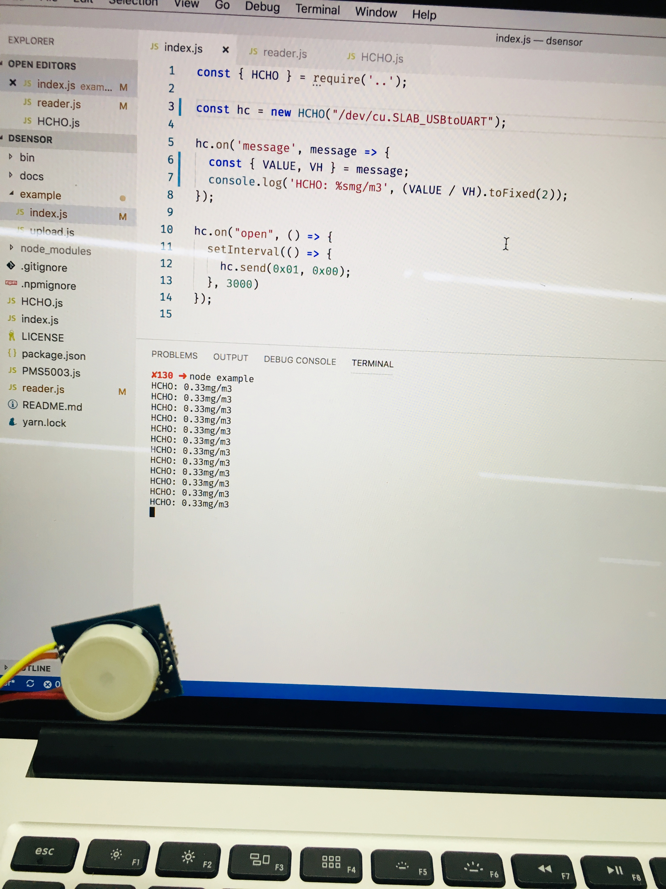

## dsensor 

> Digital universal particle concentration sensor 

### Installation

```bash
$ npm i [-g] dsensor
```

### Example

```js
const HCHO = require('dsensor/HCHO');

const sensor = new HCHO("/dev/cu.SLAB_USBtoUART");

sensor.on('message', message => {
  console.log(message.toString()); // outputs: "HCHO: 0.001Mg/m3"
});

sensor.on("open", () => {
  setInterval(() => {
    sensor.send('query');
  }, 3000);
});
```




### Contributing
- Fork this Repo first
- Clone your Repo
- Install dependencies by `$ npm install`
- Checkout a feature branch
- Feel free to add your features
- Make sure your features are fully tested
- Publish your local branch, Open a pull request
- Enjoy hacking <3

### MIT

---
